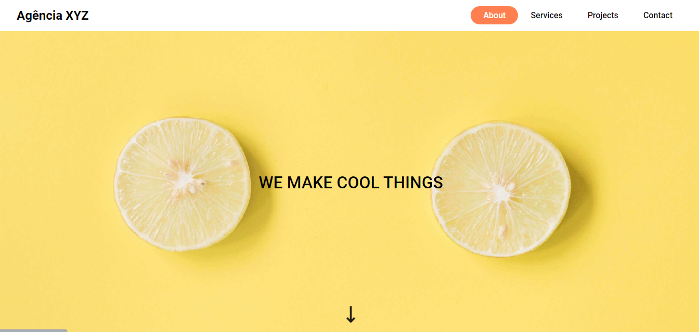
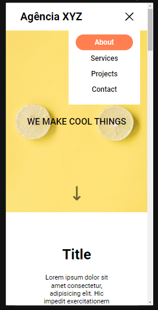

# Landing Page - Grid

Minha primeira landing page desenvolvida como um projeto de estudos.

Projeto, desenvolvido todo em HTML e CSS.

Página com menu interativo que muda de cor quando o mousse passa sobre as opções. 

Seta com animação apontando para baixo, onde informa sutilmente o usuário que abaixo ele vai encontrar mais conteúdo. 

[
    
]

Projeto com o responsivo pronto, onde é possível localizar no canto superior direito o menu sandwich e interativo, onde a cor é alterada quando o mouse passa sobre a opção.

[
    
]

